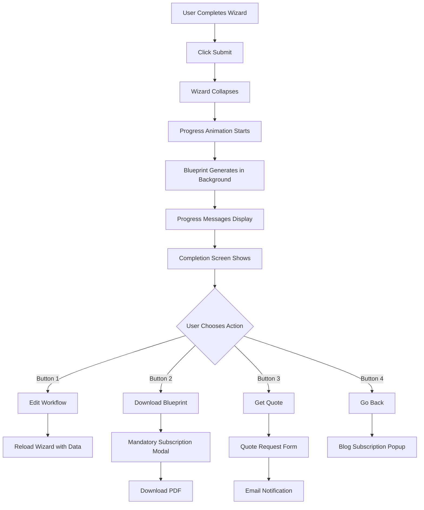
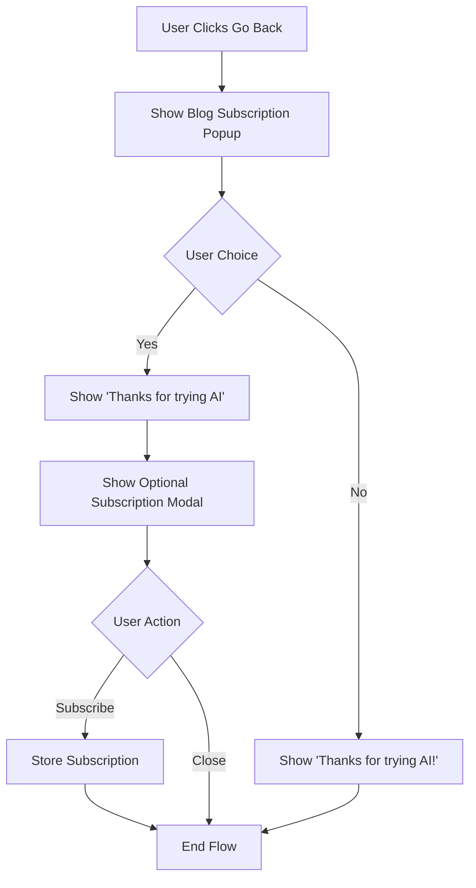

# AI Workflow Wizard Enhancement - Design Document

## Overview

This design enhances the existing 5-step wizard with a streamlined post-submission experience. After submission, the wizard collapses and displays animated progress messages while the blueprint generates in the background. Upon completion, users see a clear completion screen with four action buttons: Edit Workflow, Download Blueprint (requires mandatory subscription), Get Quote, and Go Back (offers optional blog subscription).

## Architecture

### High-Level Flow

```
User Completes Wizard
    ↓
Wizard Collapses + Progress Animation Starts
    ↓
Blueprint Generates (Background)
    ↓
Progress Messages Display Sequentially
    ↓
Completion Screen with 4 Action Buttons
    ↓
User Chooses Action:
    - Button 1: Edit Workflow → Reload wizard with data
    - Button 2: Download → Mandatory subscription → Download PDF
    - Button 3: Get Quote → Quote form → Email notification
    - Button 4: Go Back → Blog subscription offer → End
```

### Component Architecture

```
┌─────────────────────────────────────────────────────────┐
│                    Page Container                        │
│  ┌───────────────────────────────────────────────────┐  │
│  │         Wizard Form (5 steps)                     │  │
│  │         [Visible initially, collapses on submit]  │  │
│  └───────────────────────────────────────────────────┘  │
│  ┌───────────────────────────────────────────────────┐  │
│  │         Progress Animation Component              │  │
│  │         [Hidden initially, shown on submit]       │  │
│  │         - Sequential messages with delays         │  │
│  │         - Progress bar animation                  │  │
│  └───────────────────────────────────────────────────┘  │
│  ┌───────────────────────────────────────────────────┐  │
│  │         Completion Screen                         │  │
│  │         [Shown after progress completes]          │  │
│  │         - "What do you want to do next?"          │  │
│  │         - 4 Action Buttons                        │  │
│  └───────────────────────────────────────────────────┘  │
│  ┌───────────────────────────────────────────────────┐  │
│  │         Subscription Modal (Mandatory)            │  │
│  │         [Triggered by Download button]            │  │
│  │         - Cannot close until submitted            │  │
│  └───────────────────────────────────────────────────┘  │
│  ┌───────────────────────────────────────────────────┐  │
│  │         Blog Subscription Popup                   │  │
│  │         [Triggered by Go Back button]             │  │
│  │         - Yes/No question                         │  │
│  │         - Optional subscription modal             │  │
│  └───────────────────────────────────────────────────┘  │
│  ┌───────────────────────────────────────────────────┐  │
│  │         Quote Request Form                        │  │
│  │         [Triggered by Get Quote button]           │  │
│  └───────────────────────────────────────────────────┘  │
└─────────────────────────────────────────────────────────┘
```

## Components and Interfaces

### 1. Progress Animation Component

**Purpose:** Provides visual feedback during blueprint generation

**HTML Structure:**
```html
<div id="progress-container" class="progress-wrapper" style="display:none;">
  <div class="progress-messages">
    <div class="progress-message" id="progress-msg-1">
      <span class="progress-icon">⚙️</span>
      <span class="progress-text"></span>
    </div>
    <div class="progress-message" id="progress-msg-2" style="display:none;">
      <span class="progress-icon">🤖</span>
      <span class="progress-text"></span>
    </div>
    <div class="progress-message" id="progress-msg-3" style="display:none;">
      <span class="progress-icon">💬</span>
      <span class="progress-text"></span>
    </div>
  </div>
  <div class="progress-bar">
    <div class="progress-fill"></div>
  </div>
</div>
```

**JavaScript Interface:**
```javascript
class ProgressAnimation {
  constructor(containerSelector)
  show()
  hide()
  start(assistantName, onComplete)
  // Internal: displays messages sequentially
  _showMessage(index, text, delay)
  _updateProgressBar(percentage)
}
```

**Message Sequence:**
1. "Your Assistant [NAME] has been created..." (0%, 2s delay)
2. "Your Assistant [NAME] has deployed a business analysis agent..." (50%, 2s delay)
3. "Building Chat..." (75%, 2s delay)
4. Complete (100%, trigger onComplete callback)

**CSS Styling:**
- Fade-in animations for messages
- Smooth progress bar transition
- Responsive sizing for mobile
- Consistent with wizard theme

### 2. Completion Screen Component

**Purpose:** Displays action buttons after blueprint generation

**HTML Structure:**
```html
<div id="completion-screen" class="completion-container" style="display:none;">
  <div class="completion-message">
    <h2>What do you want to do next?</h2>
  </div>
  <div class="action-buttons">
    <button id="btn-edit-workflow" class="action-btn btn-primary">
      <span class="btn-icon">✏️</span>
      <span class="btn-text">Edit my Workflow</span>
    </button>
    <button id="btn-download-blueprint" class="action-btn btn-success">
      <span class="btn-icon">⬇️</span>
      <span class="btn-text">Download My Blueprint</span>
    </button>
    <button id="btn-get-quote" class="action-btn btn-info">
      <span class="btn-icon">💰</span>
      <span class="btn-text">Get a Quote for this Workflow</span>
    </button>
    <button id="btn-go-back" class="action-btn btn-secondary">
      <span class="btn-icon">↩️</span>
      <span class="btn-text">Go Back</span>
    </button>
  </div>
</div>
```

**JavaScript Interface:**
```javascript
class CompletionScreen {
  constructor(containerSelector)
  show()
  hide()
  onEditWorkflow(callback)
  onDownloadBlueprint(callback)
  onGetQuote(callback)
  onGoBack(callback)
}
```

**Button Behaviors:**
- Minimum 44px touch targets for mobile
- Hover effects for desktop
- Loading states during actions
- Disabled states when processing

### 3. Subscription Modal Component

**Purpose:** Captures user email for blueprint download or blog subscription

**HTML Structure:**
```html
<div id="subscription-modal" class="modal-overlay" style="display:none;">
  <div class="modal-content">
    <button class="modal-close" id="modal-close-btn" style="display:none;">×</button>
    <div class="modal-header">
      <h3 id="modal-title">Subscribe to Download</h3>
      <p id="modal-description">Enter your details to download your blueprint</p>
    </div>
    <form id="subscription-form" class="modal-form">
      <div class="form-group">
        <label for="sub-name">Name</label>
        <input type="text" id="sub-name" name="name" required>
        <span class="error-message" id="name-error"></span>
      </div>
      <div class="form-group">
        <label for="sub-email">Email</label>
        <input type="email" id="sub-email" name="email" required>
        <span class="error-message" id="email-error"></span>
      </div>
      <button type="submit" class="btn-submit">Subscribe</button>
    </form>
  </div>
</div>
```

**JavaScript Interface:**
```javascript
class SubscriptionModal {
  constructor(modalSelector)
  show(options) // options: { mandatory: boolean, title: string, description: string }
  hide()
  onSubmit(callback)
  validate()
  setMandatory(isMandatory) // Controls if close button is visible
}
```

**Modal Modes:**
- **Mandatory Mode** (Download): No close button, must submit
- **Optional Mode** (Blog): Close button visible, can dismiss

### 4. Blog Subscription Popup

**Purpose:** Asks user if they want to subscribe to blog when going back

**HTML Structure:**
```html
<div id="blog-popup" class="popup-overlay" style="display:none;">
  <div class="popup-content">
    <h3>Would you like to subscribe to my Blog?</h3>
    <div class="popup-buttons">
      <button id="blog-yes" class="popup-btn btn-yes">Yes</button>
      <button id="blog-no" class="popup-btn btn-no">No</button>
    </div>
  </div>
</div>
```

**JavaScript Interface:**
```javascript
class BlogSubscriptionPopup {
  constructor(popupSelector)
  show()
  hide()
  onYes(callback)
  onNo(callback)
}
```

**Flow:**
- User clicks "Go Back" button
- Popup appears with Yes/No question
- **If Yes:** Show "Thanks for trying AI" message → Show optional subscription modal
- **If No:** Show "Thanks for trying AI!" message → End flow

### 5. Quote Request Form

**Purpose:** Collects user details for formal quote request

**HTML Structure:**
```html
<div id="quote-form-container" class="quote-wrapper" style="display:none;">
  <div class="quote-header">
    <h3>Request a Quote</h3>
    <p>We'll send you a detailed quote within 24 hours</p>
  </div>
  <form id="quote-request-form" class="quote-form">
    <div class="form-group">
      <label for="quote-name">Name</label>
      <input type="text" id="quote-name" name="name" required>
    </div>
    <div class="form-group">
      <label for="quote-email">Email</label>
      <input type="email" id="quote-email" name="email" required>
    </div>
    <div class="form-group">
      <label for="quote-phone">Phone (optional)</label>
      <input type="tel" id="quote-phone" name="phone">
    </div>
    <div class="form-group">
      <label for="quote-notes">Additional Notes</label>
      <textarea id="quote-notes" name="notes" rows="4"></textarea>
    </div>
    <button type="submit" class="btn-submit">Request Quote</button>
    <button type="button" class="btn-cancel" id="quote-cancel">Cancel</button>
  </form>
</div>
```

**JavaScript Interface:**
```javascript
class QuoteRequestForm {
  constructor(formSelector)
  show()
  hide()
  onSubmit(callback)
  onCancel(callback)
  validate()
  reset()
}
```

### 6. Wizard Controller Updates

**Purpose:** Manages wizard collapse and flow transitions

**Enhanced Methods:**
```javascript
class WizardController {
  // Existing methods...
  
  // New methods for enhanced flow
  collapseWizard()
  expandWizard()
  prefillWizardData(data)
  onSubmitSuccess(blueprintData)
  handleEditWorkflow()
  handleDownloadBlueprint()
  handleGetQuote()
  handleGoBack()
}
```

**Submission Flow:**
```javascript
async onSubmit() {
  // Validate wizard data
  if (!this.validate()) return;
  
  // Collapse wizard
  this.collapseWizard();
  
  // Show progress animation
  const progress = new ProgressAnimation('#progress-container');
  const assistantName = this.generateAssistantName();
  progress.show();
  
  // Start blueprint generation (async)
  const blueprintPromise = this.generateBlueprint();
  
  // Start progress animation
  progress.start(assistantName, async () => {
    // Wait for blueprint if not ready
    const blueprint = await blueprintPromise;
    
    // Hide progress
    progress.hide();
    
    // Show completion screen
    const completion = new CompletionScreen('#completion-screen');
    completion.show();
    
    // Attach button handlers
    this.attachCompletionHandlers(completion, blueprint);
  });
}
```

## Data Models

### Blueprint Data

```javascript
{
  blueprint_id: "bp_abc123",
  session_id: "sess_xyz789",
  wizard_data: {
    goal: "...",
    workflow: "...",
    tools: "...",
    pain_points: "...",
    email: "..."
  },
  blueprint_text: "...",
  blueprint_diagram: "...", // Mermaid code or SVG
  generated_at: "2024-11-22T10:30:00Z",
  assistant_name: "WorkflowBot Alpha"
}
```

### Subscription Data

```javascript
{
  subscription_id: "sub_123",
  name: "John Doe",
  email: "john@example.com",
  subscription_type: "blueprint_download" | "blog",
  blueprint_id: "bp_abc123", // null for blog subscriptions
  subscribed_at: "2024-11-22T10:35:00Z"
}
```

### Quote Request Data

```javascript
{
  quote_id: "qt_456",
  blueprint_id: "bp_abc123",
  name: "John Doe",
  email: "john@example.com",
  phone: "+1234567890",
  notes: "Need this urgently",
  requested_at: "2024-11-22T10:40:00Z",
  status: "pending" | "sent" | "completed"
}
```

## REST API Endpoints

### 1. Blueprint Generation (Existing)

**Endpoint:** `POST /wp-json/mgrnz/v1/ai-workflow`

**Request:**
```json
{
  "goal": "Automate email processing",
  "workflow": "Manual email sorting",
  "tools": "Gmail, Sheets",
  "pain_points": "Time consuming",
  "email": "user@example.com"
}
```

**Response:**
```json
{
  "success": true,
  "blueprint_id": "bp_abc123",
  "session_id": "sess_xyz789",
  "blueprint_text": "...",
  "blueprint_diagram": "...",
  "assistant_name": "WorkflowBot Alpha"
}
```

### 2. Subscribe Endpoint (New)

**Endpoint:** `POST /wp-json/mgrnz/v1/subscribe`

**Request:**
```json
{
  "name": "John Doe",
  "email": "john@example.com",
  "subscription_type": "blueprint_download",
  "blueprint_id": "bp_abc123"
}
```

**Response:**
```json
{
  "success": true,
  "subscription_id": "sub_123",
  "download_url": "https://example.com/download/bp_abc123.pdf"
}
```

### 3. Request Quote Endpoint (New)

**Endpoint:** `POST /wp-json/mgrnz/v1/request-quote`

**Request:**
```json
{
  "blueprint_id": "bp_abc123",
  "name": "John Doe",
  "email": "john@example.com",
  "phone": "+1234567890",
  "notes": "Need this urgently"
}
```

**Response:**
```json
{
  "success": true,
  "quote_id": "qt_456",
  "message": "Quote request received. We'll send a detailed quote within 24 hours."
}
```

## User Flow Diagrams

### Main Flow



### Go Back Flow



## Error Handling

### Blueprint Generation Failure

**Scenario:** AI backend fails or times out

**Handling:**
```javascript
try {
  const blueprint = await this.generateBlueprint();
} catch (error) {
  progress.hide();
  this.showError({
    title: "Blueprint Generation Failed",
    message: "We encountered an issue generating your blueprint. Would you like to try again?",
    actions: [
      { text: "Retry", handler: () => this.onSubmit() },
      { text: "Contact Support", handler: () => this.openSupport() }
    ]
  });
}
```

### Subscription Failure

**Scenario:** Database error or validation failure

**Handling:**
```javascript
try {
  const result = await this.submitSubscription(data);
} catch (error) {
  this.showFieldError('email', 'This email is already subscribed');
  // Or show general error
  this.showModalError('Subscription failed. Please try again.');
}
```

### Quote Request Failure

**Scenario:** Email service unavailable

**Handling:**
```javascript
try {
  await this.submitQuoteRequest(data);
  this.showSuccess('Quote request submitted successfully!');
} catch (error) {
  this.showError({
    message: "We couldn't submit your quote request. Please email us directly at quotes@example.com",
    showEmailButton: true
  });
}
```

## Mobile Responsiveness

### Breakpoints

- Mobile: < 768px
- Tablet: 768px - 1024px
- Desktop: > 1024px

### Mobile Adaptations

**Progress Animation:**
- Larger text (18px vs 16px)
- Simplified icons
- Full-width progress bar

**Completion Screen:**
- Stack buttons vertically
- Full-width buttons
- Larger touch targets (min 48px height)
- Increased spacing between buttons

**Modals:**
- Full-screen on mobile
- Larger form inputs (min 44px height)
- Simplified layout
- Bottom-aligned submit buttons

**Quote Form:**
- Single column layout
- Larger textarea
- Sticky submit button at bottom

## Security Considerations

### Input Sanitization

**All User Inputs:**
```php
$sanitized_name = sanitize_text_field($_POST['name']);
$sanitized_email = sanitize_email($_POST['email']);
$sanitized_notes = sanitize_textarea_field($_POST['notes']);
```

### Rate Limiting

**Subscription Endpoint:**
- Max 5 submissions per email per hour
- Max 10 submissions per IP per hour

**Quote Request Endpoint:**
- Max 3 requests per email per day
- Max 5 requests per IP per day

### Data Privacy

**Storage:**
- Store minimal data (name, email, blueprint_id)
- Implement 30-day retention for non-subscribed users
- Provide data deletion on request

**Email Validation:**
- Verify email format
- Check for disposable email domains
- Implement double opt-in for blog subscriptions

## Testing Strategy

### Unit Tests

**Components:**
- ProgressAnimation: message sequencing, timing, completion callback
- CompletionScreen: button handlers, show/hide logic
- SubscriptionModal: validation, mandatory/optional modes
- BlogSubscriptionPopup: Yes/No handlers, message display
- QuoteRequestForm: validation, submission, cancellation

### Integration Tests

**Full Flows:**
1. Wizard submit → Progress → Completion → Edit Workflow
2. Wizard submit → Progress → Completion → Download (with subscription)
3. Wizard submit → Progress → Completion → Get Quote
4. Wizard submit → Progress → Completion → Go Back (Yes to blog)
5. Wizard submit → Progress → Completion → Go Back (No to blog)

### User Acceptance Testing

**Test Scenarios:**
1. Complete wizard, download blueprint after subscribing
2. Complete wizard, request quote, verify email received
3. Complete wizard, edit workflow, verify pre-filled data
4. Complete wizard, go back, subscribe to blog
5. Complete wizard, go back, decline blog subscription
6. Test all flows on mobile devices
7. Test error scenarios (API failures, validation errors)

## Deployment Plan

### Phase 1: Progress Animation
- Implement wizard collapse
- Add progress animation component
- Test timing and transitions

### Phase 2: Completion Screen
- Add completion screen with buttons
- Implement Edit Workflow functionality
- Test wizard reload with pre-filled data

### Phase 3: Subscription & Download
- Create subscription modal (mandatory mode)
- Implement download functionality
- Generate PDF with blueprint content

### Phase 4: Quote Request
- Add quote request form
- Implement email notifications
- Test admin notification flow

### Phase 5: Blog Subscription
- Add blog subscription popup
- Implement optional subscription modal
- Test Go Back flow variations

### Phase 6: Polish & Testing
- Mobile responsiveness
- Error handling
- Performance optimization
- User acceptance testing

## Future Enhancements

**Potential Additions:**
- Save blueprint to user account
- Email blueprint automatically
- Social sharing options
- Blueprint versioning
- Comparison of multiple blueprints
- Integration with project management tools
- Advanced analytics on user actions
