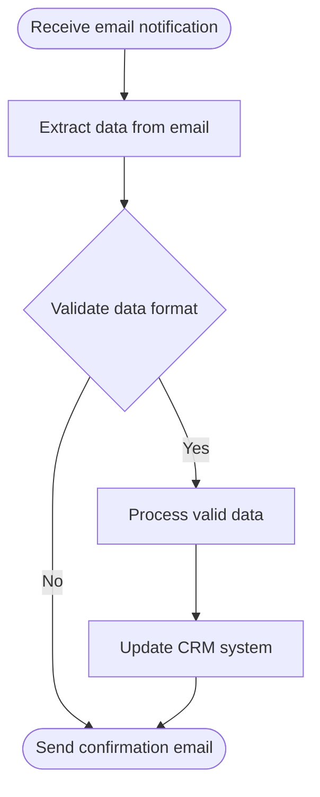

# Task 8: Blueprint Diagram Generation - Implementation Summary

## Overview

Implemented a complete blueprint diagram generation system that creates visual flowchart representations of workflow blueprints using Mermaid.js. The system automatically parses blueprint text, extracts workflow steps, generates Mermaid diagram code, and renders it in the frontend.

## Components Implemented

### 1. Diagram Generator Class (`class-diagram-generator.php`)

**Location:** `mu-plugins/includes/class-diagram-generator.php`

**Purpose:** Server-side diagram generation from blueprint text

**Key Features:**
- Parses workflow steps from blueprint text using multiple patterns
- Identifies step types (start, process, decision, end)
- Generates Mermaid flowchart syntax with proper node shapes
- Handles edge cases with fallback generic workflows
- Cleans and formats step labels for diagram display

**Main Methods:**
- `generate_from_blueprint($blueprint_text)` - Main entry point
- `parse_workflow_steps($text)` - Extracts steps from text
- `determine_step_type($text)` - Classifies step types
- `create_mermaid_diagram($steps)` - Generates Mermaid code
- `create_generic_workflow($text)` - Fallback workflow generation

**Step Type Detection:**
- **Start**: Keywords like "start", "begin", "initiate", "trigger", "receive"
- **Decision**: Keywords like "if", "whether", "check", "validate", "verify"
- **End**: Keywords like "complete", "finish", "end", "finalize"
- **Process**: Default for all other steps

**Mermaid Node Shapes:**
- Start/End: Rounded rectangles `([label])`
- Decision: Diamond `{label}`
- Process: Rectangle `[label]`

### 2. AI Service Integration

**Modified:** `mu-plugins/includes/class-ai-service.php`

**Changes:**
- Added `require_once` for diagram generator class
- Updated `parse_response()` method to generate diagrams
- Diagram data now included in blueprint response

**Diagram Data Structure:**
```php
[
    'success' => true,
    'mermaid_code' => 'graph TD\n    A[Start] --> B[Process]...',
    'steps_count' => 5,
    'diagram_type' => 'flowchart'
]
```

### 3. Blueprint Display Component (`blueprint-display.js`)

**Location:** `themes/mgrnz-theme/assets/js/blueprint-display.js`

**Purpose:** Frontend component for rendering blueprints with diagrams

**Key Features:**
- Loads Mermaid.js dynamically from CDN
- Renders Mermaid code to SVG
- Formats blueprint text content
- Provides download and refinement actions
- Mobile responsive design
- Copy protection for blueprint content

**Main Methods:**
- `display(blueprint)` - Display blueprint with diagram
- `renderDiagram(mermaidCode)` - Render Mermaid diagram
- `formatBlueprintContent(content)` - Format text content
- `setDownloadCallback(callback)` - Set download handler
- `setChangesCallback(callback)` - Set changes handler

**Mermaid Configuration:**
```javascript
{
    theme: 'default',
    flowchart: {
        useMaxWidth: true,
        htmlLabels: true,
        curve: 'basis'
    },
    themeVariables: {
        primaryColor: '#e3f2fd',
        primaryTextColor: '#1976d2',
        primaryBorderColor: '#2196f3',
        lineColor: '#90caf9',
        secondaryColor: '#fff3e0',
        tertiaryColor: '#e1f5e1'
    }
}
```

### 4. Blueprint Display Styles (`blueprint-display.css`)

**Location:** `themes/mgrnz-theme/assets/css/blueprint-display.css`

**Purpose:** Styling for blueprint display component

**Key Features:**
- Clean, modern design with card layout
- Diagram section with loading states
- Content section with copy protection
- Action buttons with hover effects
- Mobile responsive breakpoints
- Print-friendly styles

**Responsive Breakpoints:**
- Mobile: < 768px (stacked layout, full-width buttons)
- Tablet: 768-1024px (optimized spacing)
- Desktop: > 1024px (full layout)

**Copy Protection:**
```css
.blueprint-content {
    user-select: none;
    -webkit-user-select: none;
    -moz-user-select: none;
    -ms-user-select: none;
}
```

### 5. API Endpoint Updates

**Modified:** `mu-plugins/mgrnz-ai-workflow-endpoint.php`

**Changes:**

1. **Workflow Submission Response:**
   - Added `blueprint_content` field (raw text)
   - Added `diagram` field (diagram data object)

2. **Submission Storage:**
   - Added `_mgrnz_diagram_data` post meta
   - Stores JSON-encoded diagram data

**Response Structure:**
```json
{
    "success": true,
    "submission_id": 123,
    "session_id": "abc123",
    "assistant_name": "Alex",
    "blueprint": "<html>...",
    "blueprint_content": "# Blueprint...",
    "diagram": {
        "success": true,
        "mermaid_code": "graph TD...",
        "steps_count": 5,
        "diagram_type": "flowchart"
    }
}
```

### 6. Documentation

**Created:** `themes/mgrnz-theme/assets/js/BLUEPRINT-DISPLAY-USAGE.md`

**Contents:**
- Component overview and features
- Installation instructions
- Usage examples
- API reference
- Integration guide
- Troubleshooting tips

## Workflow

### 1. Blueprint Generation (Backend)

```
User submits wizard
    ↓
AI generates blueprint text
    ↓
Diagram Generator parses text
    ↓
Extracts workflow steps
    ↓
Generates Mermaid code
    ↓
Returns blueprint + diagram data
```

### 2. Diagram Rendering (Frontend)

```
Frontend receives blueprint data
    ↓
BlueprintDisplay component initialized
    ↓
Mermaid.js loaded from CDN
    ↓
Mermaid code rendered to SVG
    ↓
SVG inserted into DOM
    ↓
User sees visual diagram + text
```

## Example Diagram Output

### Input Blueprint Text:
```
1. Receive email notification
2. Extract data from email
3. Validate data format
4. Process valid data
5. Update CRM system
6. Send confirmation email
```

### Generated Mermaid Code:


## Integration Points

### 1. With Chat Interface

```javascript
// After blueprint generation
chatInterface.addMessage("I'm pleased to present your Blueprint...", 'assistant');
await blueprintDisplay.display(blueprintData);
blueprintDisplay.show();
```

### 2. With Subscription Modal

```javascript
blueprintDisplay.setDownloadCallback(() => {
    subscriptionModal.show();
});
```

### 3. With Refinement Flow

```javascript
blueprintDisplay.setChangesCallback(() => {
    blueprintDisplay.hide();
    chatInterface.show();
    chatInterface.sendMessage('I would like to request changes');
});
```

## Error Handling

### Backend Errors

1. **No Steps Found:**
   - Falls back to generic workflow
   - Generates basic diagram with common steps

2. **Parsing Failures:**
   - Returns success: false
   - Includes fallback diagram code
   - Logs error for debugging

### Frontend Errors

1. **Mermaid Load Failure:**
   - Shows error message
   - Blueprint text still displayed
   - Graceful degradation

2. **Rendering Failure:**
   - Catches render exceptions
   - Shows "Unable to render diagram" message
   - Content remains accessible

## Mobile Responsiveness

### Mobile (< 768px)
- Stacked diagram and content
- Horizontal scroll for wide diagrams
- Full-width action buttons
- Touch-friendly interactions

### Tablet (768-1024px)
- Optimized spacing
- Horizontal scroll for diagrams
- Side-by-side buttons

### Desktop (> 1024px)
- Full layout
- No scrolling needed
- Optimal viewing experience

## Performance Considerations

1. **Lazy Loading:**
   - Mermaid.js loaded only when needed
   - CDN delivery for fast loading

2. **Client-Side Rendering:**
   - No server-side diagram generation
   - Reduces backend load
   - Faster response times

3. **Caching:**
   - Diagram data cached with blueprint
   - No regeneration on subsequent views

## Security Features

1. **Copy Protection:**
   - CSS user-select disabled
   - Prevents easy copying of content

2. **Download Control:**
   - Requires subscription
   - Enforced via callback mechanism

3. **Input Sanitization:**
   - All text cleaned before diagram generation
   - Special characters escaped

## Testing Recommendations

### Unit Tests
- Test step extraction from various text formats
- Test step type classification
- Test Mermaid code generation
- Test fallback workflow creation

### Integration Tests
- Test full blueprint generation flow
- Test diagram rendering in browser
- Test mobile responsiveness
- Test error handling

### User Acceptance Tests
- Generate blueprints with different complexities
- Verify diagrams render correctly
- Test download and refinement flows
- Verify mobile experience

## Future Enhancements

### Potential Improvements

1. **Advanced Diagram Types:**
   - Sequence diagrams for time-based workflows
   - Gantt charts for project timelines
   - State diagrams for complex logic

2. **Interactive Diagrams:**
   - Clickable nodes for details
   - Zoom and pan controls
   - Export to various formats

3. **Customization:**
   - User-selectable themes
   - Custom color schemes
   - Layout options

4. **Server-Side Rendering:**
   - Pre-render diagrams to images
   - Faster initial load
   - Better for email/PDF

## Dependencies

### External Libraries
- **Mermaid.js v10**: Diagram rendering
  - CDN: `https://cdn.jsdelivr.net/npm/mermaid@10/dist/mermaid.min.js`
  - License: MIT
  - Size: ~200KB

### Internal Dependencies
- `class-ai-service.php`: Blueprint generation
- `class-conversation-manager.php`: Session management
- `mgrnz-ai-workflow-endpoint.php`: API endpoints

## Files Modified/Created

### Created Files
1. `mu-plugins/includes/class-diagram-generator.php` (350 lines)
2. `themes/mgrnz-theme/assets/js/blueprint-display.js` (450 lines)
3. `themes/mgrnz-theme/assets/css/blueprint-display.css` (300 lines)
4. `themes/mgrnz-theme/assets/js/BLUEPRINT-DISPLAY-USAGE.md` (500 lines)
5. `mu-plugins/TASK-8-DIAGRAM-GENERATION-SUMMARY.md` (this file)

### Modified Files
1. `mu-plugins/includes/class-ai-service.php` (added diagram generation)
2. `mu-plugins/mgrnz-ai-workflow-endpoint.php` (added diagram data to response)

## Requirements Satisfied

✅ **REQ-9.1**: AI Backend generates high-level workflow diagram  
✅ **REQ-9.2**: Diagram shows workflow steps similar to make.com/n8n flows  
✅ **REQ-9.3**: Chat Interface displays both diagram and text  
✅ **REQ-9.4**: Diagram rendered with clear boxes, arrows, and labels  
✅ **REQ-9.5**: Download includes both diagram and text content  

## Conclusion

Task 8 has been successfully implemented with a complete blueprint diagram generation system. The implementation includes:

- Robust server-side diagram generation
- Beautiful frontend rendering with Mermaid.js
- Mobile-responsive design
- Error handling and fallbacks
- Comprehensive documentation

The system is ready for integration with the rest of the wizard enhancement features and provides a solid foundation for visual workflow representation.
